# Project 02 - Image Processing

## Overview

This project focuses on fundamental image processing techniques using Python. It includes:
- Reading and displaying images
- Saving images after manipulation
- Basic image transformation functions:
    - Brightness control
    - Contrast control
    - Flip the image (Vertically and Horizontially)
    - Apply grayscale and sepia filter
    - Sharpen the image
    - Make the image blurred (Box, 3x3, 5x5 kernel)
    - Crop the image in the center
    - Circular crop the image and symmetrical 2-ellipse crop the image

 
The project uses common libraries such as `numpy`, `matplotlib`, and `PIL`.

## Output example
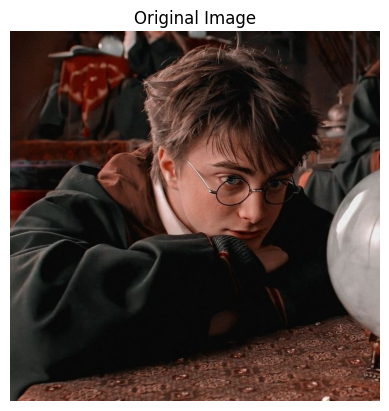
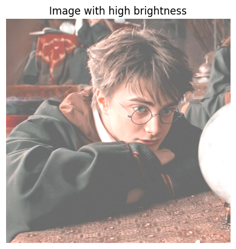

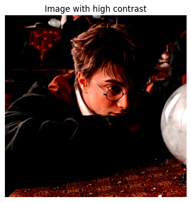
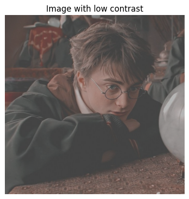
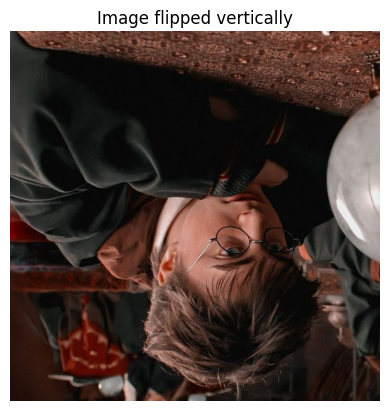
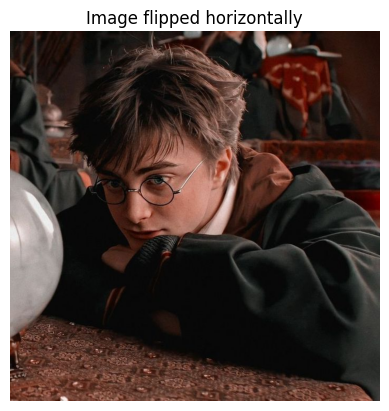
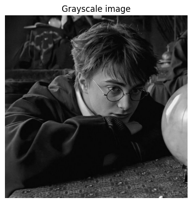
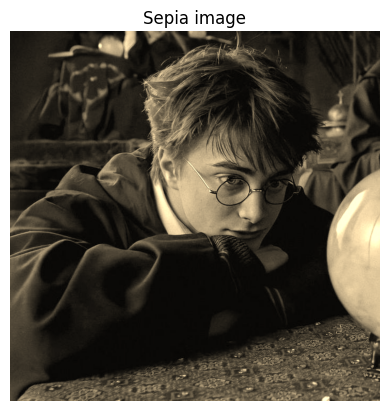

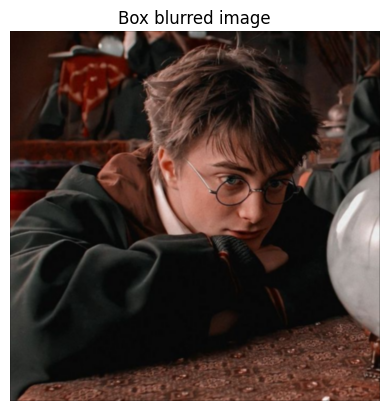
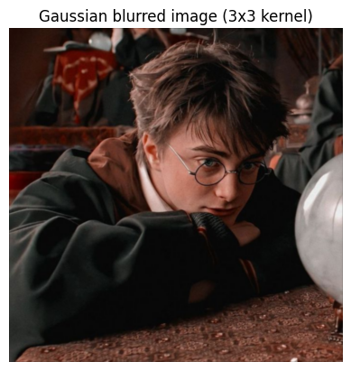
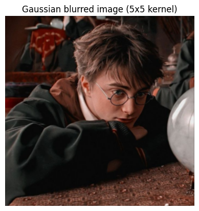
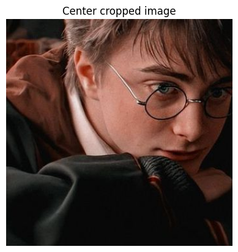
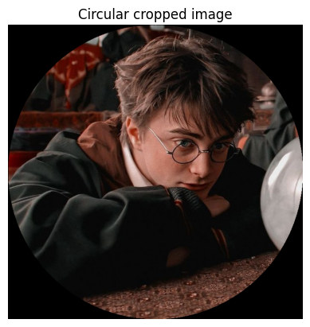
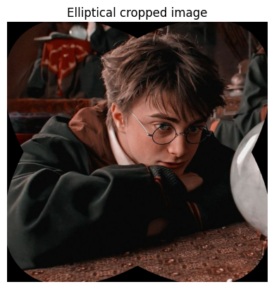
